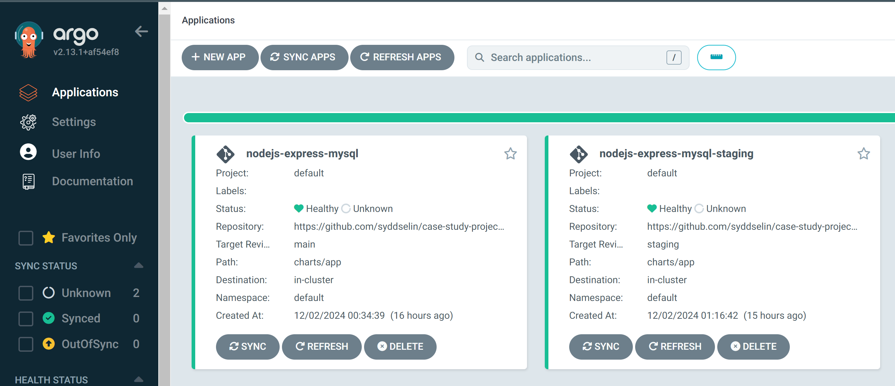

# Project Overview

This project demonstrates the deployment of a Node.js application with a MySQL database on a Kubernetes cluster. The setup uses Helm for templated Kubernetes manifests and ArgoCD for GitOps-based Continuous Deployment. 

- Node.js backend with MySQL integration.
- Dockerized application for portability.
- Kubernetes deployments using Helm charts.
- GitOps-based Continuous Deployment using ArgoCD.
- External Secrets integration for secure environment variables.
- Support for multiple environments (`staging`, `production`). 

---


## Features

### Comprehensive RESTful API with MySQL Integration
- A RESTful API is developed using **Node.js**, enabling **CRUD** (Create, Read, Update, Delete) operations on the **MySQL** database.
- Environment variables (**DB_HOST**, **DB_USER**, **DB_PASSWORD**, **DB_NAME**) configure database communication, ensuring flexibility and security.
- Data persistence is ensured through **PersistentVolumeClaim (PVC)**, preventing data loss across Pod restarts.

### Containerization and Deployment
- The application is containerized using **Docker**.
- Both the **Node.js application** and **MySQL database** are deployed and managed as Kubernetes Pods.
- Kubernetes enhances scalability, manageability, and modularity, allowing horizontal and vertical scaling as needed. 
- Deployment templates are structured with **Helm Charts** for ease of scalability and modularity.

### Service and Traffic Management
- Kubernetes **Service** objects, such as `NodePort` and `ClusterIP`, manage internal and external traffic effectively.
- External access is configured via **NGINX Ingress Controller**, allowing DNS-based access (`http://chart-example.local/`).
- A user-friendly architecture ensures seamless integration of new services and scalability.
- Distinct environments for `staging` and `production` are managed within Kubernetes.

### Continuous Deployment with ArgoCD**
- **ArgoCD** is used to automate the Continuous Deployment process.
- GitOps principles are followed, with Git serving as the single source of truth for application state.


### Security and Secret Management**
- Secrets, such as database credentials, are securely stored and managed with **Kubernetes Secrets**.
- Supports seamless updates and secure access to sensitive environment variables.

### Testing and Compatibility
- The application is designed to run seamlessly on diverse environments, leveraging **Docker** and **Kubernetes** compatibility.
- Its API endpoints can be easily tested using tools like `curl` or **Postman**.

---

## Requirements

- **[Docker](https://www.docker.com/)** & a **[Docker Hub](https://hub.docker.com/) account**  
- **[Kubernetes](https://kubernetes.io/)**  
- **[Minikube](https://minikube.sigs.k8s.io/docs/)** or **[Docker Desktop](https://www.docker.com/products/docker-desktop/)** for local Kubernetes environment setup  
- **Helm installed.
- ArgoCD installed on the Kubernetes cluster.
- NGINX Ingress Controller for routing traffic.

### Installation

1. **Clone the Repository**  
   ```bash
   git clone https://github.com/syddselin/case-study-project.git
   cd case-study-project
   ```

2. **Build Docker Images** 
   ```bash
   docker build -t syddselin/nodejs-app:latest ./nodejs
   docker build -t syddselin/mysql:latest ./mysql
   ```

3. **Push Docker Images** 
   ```bash
   docker push syddselin/nodejs-app:latest
   docker push syddselin/mysql:latest
   ```

4. **Deploy the Application with Helm** 
   ```bash
   helm upgrade --install app ./charts/app -f ./charts/app/values.yaml
   ```
5. **Deploy the Application with Helm** 
   ```bash
   kubectl get pods
   ```
   ```bash
   kubectl get services
   ```
   ```bash
   kubectl get ingress
   ```
   
## **Access**
Application is accessible at http://chart-example.local/ (ensure your /etc/hosts is updated if using local Kubernetes).


## **Tools and Technologies**
- Node.js for application development.
MySQL for database integration.
Docker for containerization.
Kubernetes for orchestration.
Helm for managing Kubernetes configurations.
ArgoCD for Continuous Deployment.

## **Author**
Developed by Syddselin as part of a Kubernetes deployment case study.
Test CI/CD
